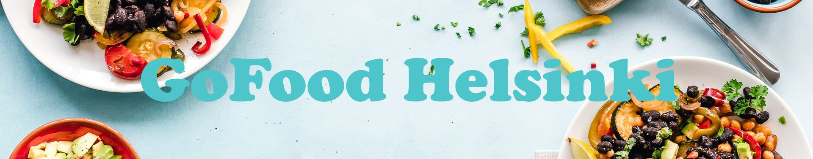

# GoFood Helsinki App
## General Info
GoFood Helsinki is a single-page RESTful application, which helps to discover restaurants in Helsinki. 
GoFood Helsinki includes integration of Open Data provided by MyHelsinki Open API. 
The project was created with ReactJS frontend and NodeJS backend and 
it uses MySQL database for information storage and retrieval.

## Features
GoFood Helsinki has a search and filter option that helps to find restaurants by name and location.
The app has also a favorite list, where the client can add preferred restaurants. 
Restaurants can also be deleted from the list.

## REST API Requests
Host: localhost:8080  
Origin: http://localhost:3000  
Accept: application/json, text/plain, `*/*`
  

### `app.get('/favorites')`
 **Sends all restaurants to the client in json format.** 
Request URL: http://localhost:8080/favorites 
Request Method: GET

SQL 
`SELECT * from restaurants` 
JSON 
`[{id: 3048, name: "Addis Ethiopian Kitchen", street: "Sturenkatu 28", postcode: "00510", city: "Helsinki", url: "https://www.addiskitchen.fi/", image: "https://edit.myhelsinki.fi/sites/default/files/styles/api_1980x1020/public/2017-11/18582201_1304054686382343_5281764182844447292_n.jpg?h=af5d0fd7&itok=8uXrL4iG", 
mon: "11-20", tues: "11-20", wed: "11-20", thur: "11-20", fri: "11-20", sat: "12-20", sun: "12-20"}, ... ]`
  

### `app.post('/favoritesAdd')`
 **Adds a restaurant to a favorite list. Gets all data required from the client and puts it to database.** 
Request URL: http://localhost:8080/favoritesAdd 
Request Method: POST

SQL 
`INSERT INTO restaurants(id, name, street, postcode, city, image, url, mon, tues, wed, thur, fri, sat, sun) values(?,?,?,?,?,?,?,?,?,?,?,?,?,?)` 
JSON 
`{id: 3048, name: "Addis Ethiopian Kitchen", street: "Sturenkatu 28", postcode: "00510", city: "Helsinki", url: "https://www.addiskitchen.fi/",
image: "https://edit.myhelsinki.fi/sites/default/files/styles/api_1980x1020/public/2017-11/18582201_1304054686382343_5281764182844447292_n.jpg?h=af5d0fd7&itok=8uXrL4iG",
mon: "11-20", tues: "11-20", wed: "11-20", thur: "11-20", fri: "11-20", sat: "12-20", sun: "12-20"}`
  

### `app.delete('/favorites/:id')`
 **Deletes a restaurant from the favorite list by ID** 
Request URL: http://localhost:8080/favorites/{id} 
Request Method: DELETE

SQL 
`DELETE FROM restaurants WHERE id = ?`

